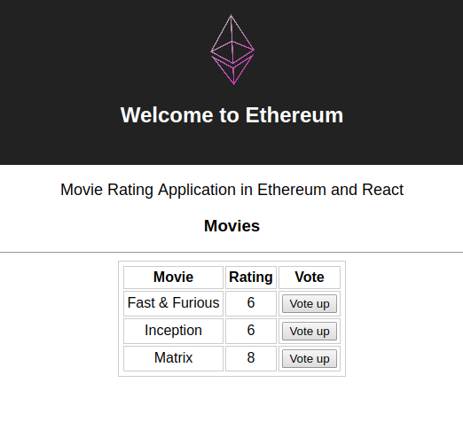

# React-Ethereum-Movie-Rating-Dapp - Decentralized movie rating application with React

## Frontend:
git clone https://github.com/technoknol/Ethereum-movie-rating-dapp.git dapp  
cd dapp 
cd appui  
npm install 
npm start 

## Make sure your testRPC network is runnig before launching the application
### OR 
## Setup Ganache
Install Ganache 
Open Ganache 
Change port from 7545 to 8545    

## Demo

